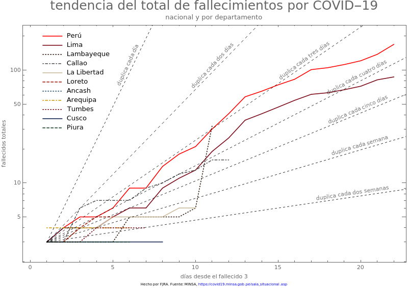

```{r setup, include=FALSE}
knitr::opts_chunk$set(echo = FALSE,warning = FALSE, message = FALSE)
```

```{r Librerias, echo=FALSE, message=FALSE}
library(rio)
library(gridExtra)
library(kableExtra)
library(JLutils) # devtools::install_github("larmarange/JLutils")
library(tidyverse)
library(cowplot)
library(sf)
library(ggrepel)
library(readxl)
library(cowplot)
library(ggpubr)
library(directlabels)
data=import("reportes_minsa.xlsx")
```


# Mapa casos positivos


```{r Mapa, message=FALSE}
departamento <- read_sf("data/departamentos/DEPARTAMENTOS.shp") %>%
  select(Departamento = DEPARTAMEN, geometry)

data2 = import("reportes_minsa.xlsx", sheet=2)
data3 = data2 %>%
  filter(Fecha == max(data2$Fecha)) %>%
  dplyr::rename(Departamento = REGION) %>%
  dplyr::group_by(Departamento) %>%
  dplyr::summarise(casos = sum(Positivos_totales))

m1 = departamento %>%
  left_join(data3, by="Departamento") %>%
  mutate(casos = replace_na(casos,0),
         casos=as.factor(casos),
         label = paste0(Departamento, ": ", casos))%>%
  ggplot() +
    geom_sf(aes(fill = casos), size = 0.05, color = "grey40") +
  # colorRampPalette crea una paleta de colores del tamaño de factor(casos) -1
    scale_fill_manual(values = c("grey80", colorRampPalette(colors = c("#FFF5F0","#FB6A4A", "#67000D"))(length(unique(data3$casos)-1)))) +
  ggrepel::geom_label_repel(
    aes(label = label, geometry = geometry),
    stat = "sf_coordinates", 
    size = 2.3,
    min.segment.length = 0
  )+
    scale_x_discrete()+
  theme_bw()+
  theme(legend.position = "none",
        axis.title = element_blank())
 
```


```{r Panelm1, echo=FALSE, fig.height=7, message=FALSE, warning=FALSE}
# Panel para publicacion
panel<- ggarrange(m1,
          ncol=1,nrow=1,
          font.label = list(size = 10, color = "black", face = "bold", family = NULL))
          annotate_figure(panel,
                top = text_grob("Distribución  de casos positivos COVID-19 x departamento,\n (moleculares + pruebas rápidas) Perú", 
                                color = "#474785", 
                                face = "bold", 
                                size = 14),
                bottom = text_grob(
                  paste0(
                    "Actualizado al ", 
                    format(as.Date(max(data$Dia)),"%d/%m"),
                    "\n",
                    "Fuente: MINSA.Ver (https://jincio.github.io/COVID_19_PERU/Propagacion.html)"), 
                                   color = "black", 
                                   hjust = 1, 
                                   x = 1, 
                                   face = "italic", 
                                   size = 8)
                #left = text_grob("Figure arranged using ggpubr", color = "green", rot = 90),
                #fig.lab = "Figure 1", fig.lab.face = "bold"
)

```


## Mapas Fallecidos

```{r m2}
departamento <- read_sf("data/departamentos/DEPARTAMENTOS.shp") %>%
  select(Departamento = DEPARTAMEN, geometry)

data2 = import("reportes_minsa.xlsx", sheet=2)
data3 = data2 %>%
  filter(Fecha == max(data2$Fecha)) %>%
  dplyr::rename(Departamento = REGION) %>%
  dplyr::group_by(Departamento) %>%
  dplyr::summarise(casos = sum(Fallecidos))

m1 = departamento %>%
  left_join(data3, by="Departamento") %>%
  mutate(casos = replace_na(casos,0),
         casos=as.factor(casos),
         label = paste0(Departamento, ": ", casos))%>%
  ggplot() +
    geom_sf(aes(fill = casos), size = 0.05, color = "grey40") +
  # colorRampPalette crea una paleta de colores del tamaño de factor(casos) -1
    scale_fill_manual(values = c("grey80", colorRampPalette(colors = c("#FFF5F0","#FB6A4A", "#67000D"))(length(unique(data3$casos)-1)))) +
  ggrepel::geom_label_repel(
    aes(label = label, geometry = geometry),
    stat = "sf_coordinates", 
    size = 2.3,
    min.segment.length = 0
  )+
    scale_x_discrete()+
  theme_bw()+
  theme(legend.position = "none",
        axis.title = element_blank())
```


```{r Panelm2, echo=FALSE, fig.height=7, message=FALSE, warning=FALSE}
# Panel para publicacion
panel<- ggarrange(m1,
          ncol=1,nrow=1,
          font.label = list(size = 10, color = "black", face = "bold", family = NULL))
          annotate_figure(panel,
                top = text_grob("Distribución  de fallecidos COVID-19 x departamento,\n Perú", 
                                color = "#474785", 
                                face = "bold", 
                                size = 14),
                bottom = text_grob(
                  paste0(
                    "Actualizado al ", 
                    format(as.Date(max(data$Dia)),"%d/%m"),
                    "\n",
                    "Fuente: MINSA.Ver (https://jincio.github.io/COVID_19_PERU/Propagacion.html)"), 
                                   color = "black", 
                                   hjust = 1, 
                                   x = 1, 
                                   face = "italic", 
                                   size = 8)
                #left = text_grob("Figure arranged using ggpubr", color = "green", rot = 90),
                #fig.lab = "Figure 1", fig.lab.face = "bold"
)

```

# Tendencias por departamento

## Comparadas con Nacional y Lima

```{r echo=FALSE, out.width='80%'}
knitr::include_graphics('./Imagenes/tendenciaCaso10-nacional-departamento-abril-9.png')
```

```{r echo=FALSE, out.width='80%'}
knitr::include_graphics('./Imagenes/tendenciaCaso100-nacional-departamento-abril-9.png')
```

```{r echo=FALSE, out.width='80%'}

```


## Por Macro-Región


```{r plot_macro}
data4 = import("reportes_minsa.xlsx", sheet=2)%>%
  mutate(
    MACROREG= case_when(
        REGION %in% c("TUMBES","PIURA","LAMBAYEQUE","LA LIBERTAD","CAJAMARCA","ANCASH")~"NORTE",
        REGION %in% c("AMAZONAS","LORETO","UCAYALI","MADRE DE DIOS","SAN MARTIN") ~ "ORIENTE",
        REGION %in% c("ICA","MOQUEGUA","AREQUIPA","TACNA","PUNO","CUSCO") ~ "SUR",
        REGION%in%c("AYACUCHO","APURIMAC","JUNIN", "HUANCAVELICA", "HUANUCO", "PASCO")~ "CENTRO",
        TRUE ~ "OTRO"),
    Fecha = as.Date(Fecha),
    Positivos=Positivos_totales
  )
  
plot_macro <- function(macroregion, breaks = "7 days", ncol = 3, .data = data4){
  temp <- .data%>%
    filter(MACROREG== macroregion) %>% 
    group_by(REGION, Positivos_PCR) %>% 
    mutate(label = ifelse(row_number() == 1, Positivos, NA)) %>% 
    ungroup() %>% 
    group_by(REGION) %>% 
    mutate(label = ifelse(row_number() == n(), Positivos, label))
  
  plot <- temp %>%
    ggplot(aes(x = Fecha, y=Positivos)) +
    geom_line(color = "darkred")+
    ylim(0,max(temp$Positivos)*1.1)+
    scale_x_date(
      labels = scales::date_format("%b-%d"), 
      date_breaks = "5 days", 
      expand = c(0,1))+
    geom_text_repel(
      aes(label = label), 
      vjust = -0.3,
      size = 2.1,
      box.padding = 0.05)+
    labs(y="Número de casos reportados")+
    facet_wrap(~ REGION, ncol=ncol)
  
  ggarrange(plot,
          ncol=1,nrow=1,
          font.label = list(size = 10, color = "black", face = "bold", family = NULL)) %>% 
          annotate_figure(
                top = text_grob(
                  paste("Número de casos positivos COVID-19,", macroregion), 
                  color = "#474785", face = "bold", size = 14),
                bottom = text_grob("Fuente: MINSA. Ver (https://jincio.github.io/COVID_19_PERU/Propagacion.html)", 
                                   color = "black", 
                                   hjust = 1, 
                                   x = 1, face = "italic", size = 8))
}
```

## CENTRO 

```{r,panelcentro1}
plot_macro("CENTRO")
```

## NORTE 

```{r,panelNORTE1}
plot_macro("NORTE")
```

## SUR
```{r,panelSUR1}
plot_macro("SUR")
```

## ORIENTE

```{r,panelORIENTE1}
plot_macro("ORIENTE")
```

# Tabla 

```{r}
data2%>%
  dplyr::select(REGION,
                Positivos_PCR,Positivos_PR,Positivos_totales,
                "Dia"="Fecha")%>%
  mutate(Dia = as.character(Dia)) %>% 
  arrange(desc(Dia),desc(Positivos_PCR)) %>%
  DT::datatable(
    options = list(pageLength = 10, 
                   lengthMenu = c(10, 25, 40),
                   language = list(lengthMenu = "Mostrar _MENU_ entradas",
                                   info ="Mostrando _START_ al _END_ de _TOTAL_ entradas",
                                   search = "Buscar:",
                                   paginate = list(previous = "Anterior",
                                                   'next' = "Siguiente"))
                   ),
    rownames = FALSE
  )
```

