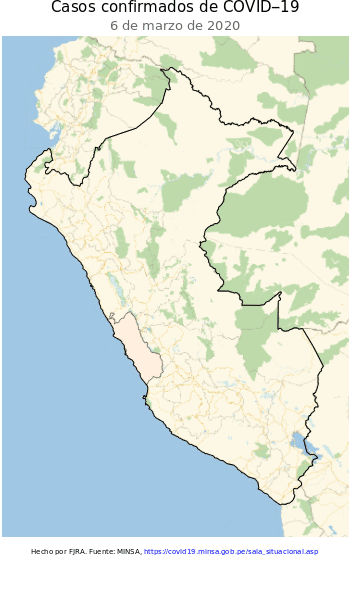
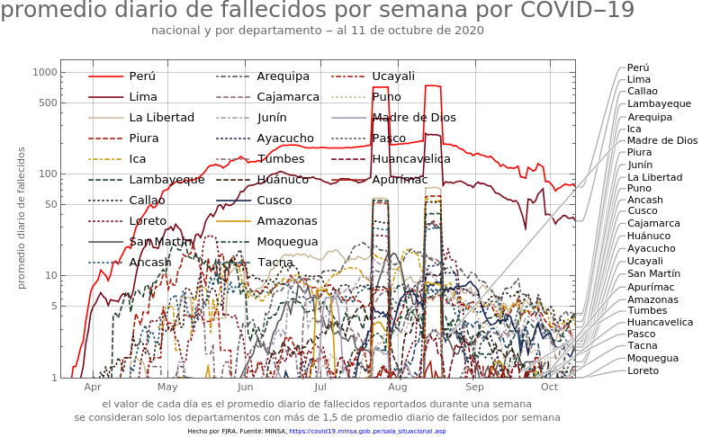
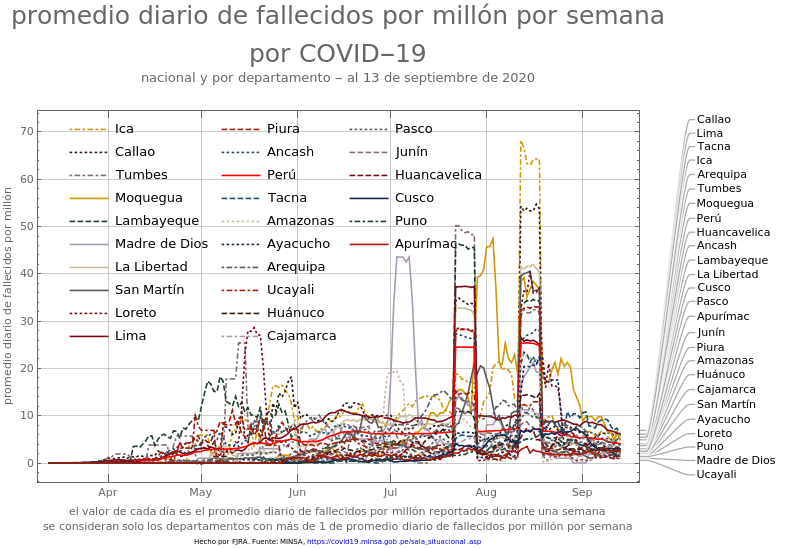
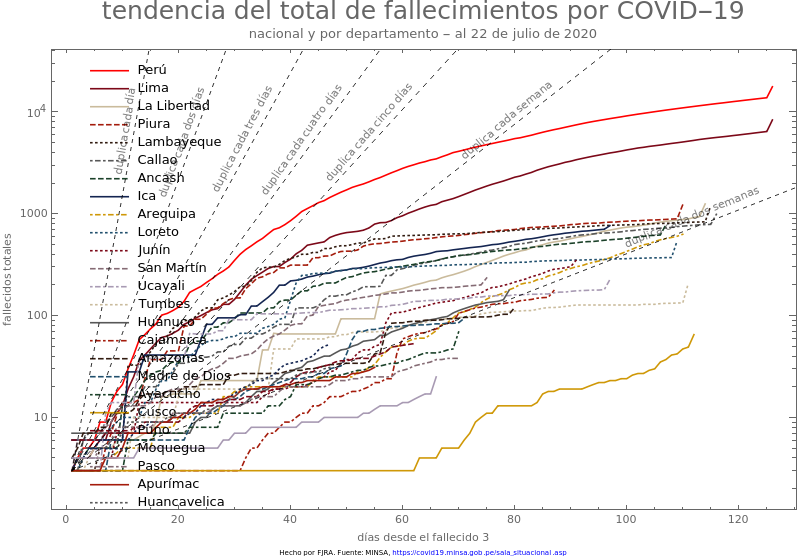
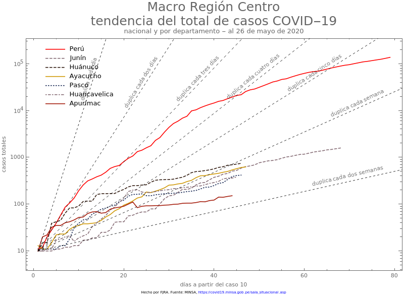
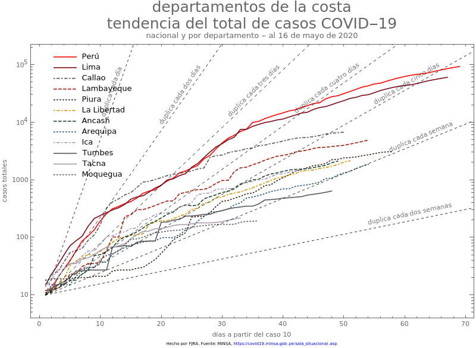
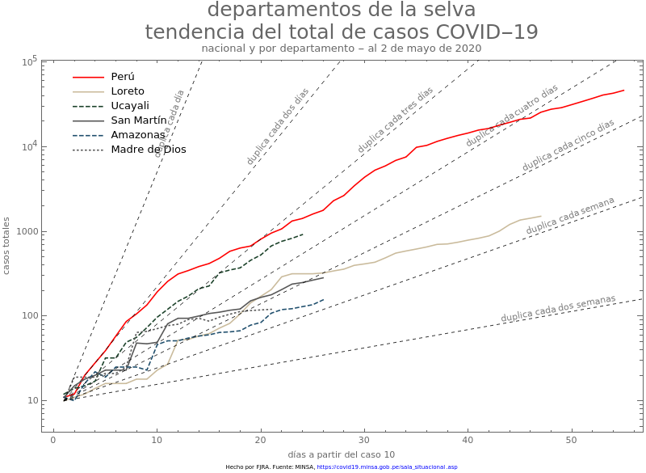
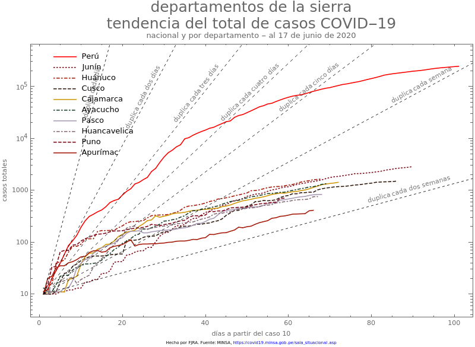
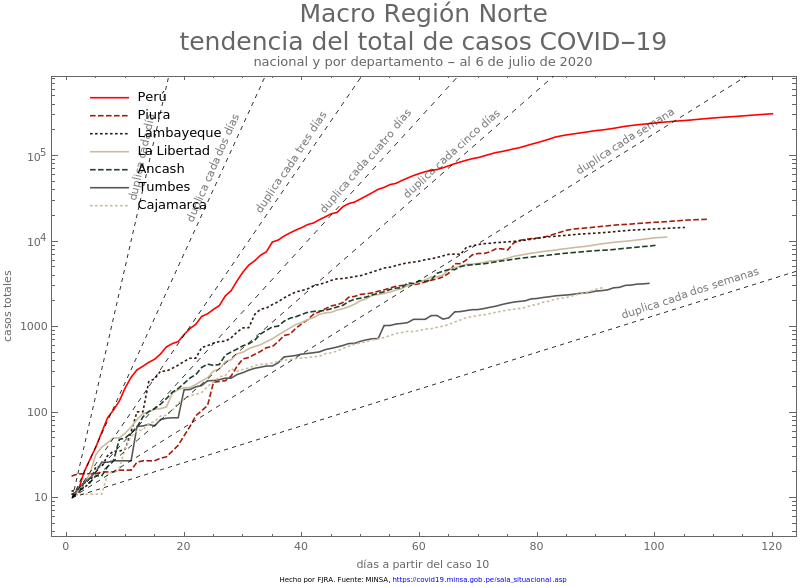

```{r setup, include=FALSE}
knitr::opts_chunk$set(echo = FALSE,warning = FALSE, message = FALSE)
```

```{r Librerias, echo=FALSE, message=FALSE}
library(tidyverse)
library(rio)
library(sf)
library(ggrepel)
library(ggpubr)
library(cowplot)
library(kableExtra)
library(directlabels)
library(ggiraph)
data=rio::import("reportes_minsa.xlsx")

source("global.R", encoding = "UTF-8")
```


# Distribución casos positivos y fallecidos por región


```{r Mapa, message=FALSE}
departamento <- sf::read_sf("data/departamentos/DEPARTAMENTOS.shp") %>%
  dplyr::select(Departamento = DEPARTAMEN, geometry)

data2 = rio::import("reportes_minsa.xlsx", sheet=3)
data3 = data2 %>%
  dplyr::filter(Fecha == max(data2$Fecha)) %>%
  dplyr::rename(Departamento = REGION) %>%
  dplyr::group_by(Departamento) %>%
  dplyr::summarise(casos = sum(Positivos_totales))

m1 = departamento %>%
  dplyr::left_join(data3, by="Departamento") %>%
  dplyr::mutate(casos = tidyr::replace_na(casos,0),
         casos=as.factor(casos),
         label = paste0(Departamento, ": ", casos))%>%
  ggplot2::ggplot() +
    ggplot2::geom_sf(ggplot2::aes(fill = casos), size = 0.05, color = "grey40") +
  # colorRampPalette crea una paleta de colores del tamaño de factor(casos) -1
    ggplot2::scale_fill_manual(values = c(grDevices::colorRampPalette(colors = c("#FFF5F0","#FB6A4A", "#67000D"))(length(unique(data3$casos))))) +
  ggrepel::geom_label_repel(
    ggplot2::aes(label = label, geometry = geometry),
    stat = "sf_coordinates", 
    size = 2.3,
    min.segment.length = 0
  )+
    ggplot2::scale_x_discrete()+
  ggtitle("Casos positivos por región")+
  ggplot2::theme_bw()+
  ggplot2::theme(legend.position = "none",
        axis.title = ggplot2::element_blank())
 
```


```{r m2}
departamento <- sf::read_sf("data/departamentos/DEPARTAMENTOS.shp") %>%
  dplyr::select(Departamento = DEPARTAMEN, geometry)

data2 = rio::import("reportes_minsa.xlsx", sheet=3)
data3 = data2 %>%
  dplyr::filter(Fecha == max(data2$Fecha)) %>%
  dplyr::rename(Departamento = REGION) %>%
  dplyr::group_by(Departamento) %>%
  dplyr::summarise(casos = sum(Fallecidos))

m2 = departamento %>%
  dplyr::left_join(data3, by="Departamento") %>%
  dplyr::mutate(casos = tidyr::replace_na(casos,0),
         casos=as.factor(casos),
         label = paste0(Departamento, ": ", casos))%>%
  ggplot2::ggplot() +
    ggplot2::geom_sf(ggplot2::aes(fill = casos), size = 0.05, color = "grey40") +
  # colorRampPalette crea una paleta de colores del tamaño de factor(casos) -1
    ggplot2::scale_fill_manual(values = c("grey80", grDevices::colorRampPalette(colors = c("#FFF5F0","#FB6A4A", "#67000D"))(length(unique(data3$casos)-1)))) +
  ggrepel::geom_label_repel(
    ggplot2::aes(label = label, geometry = geometry),
    stat = "sf_coordinates", 
    size = 2.3,
    min.segment.length = 0
  )+
    ggplot2::scale_x_discrete()+
  ggtitle("Número de fallecidos por región")+
  ggplot2::theme_bw()+
  ggplot2::theme(legend.position = "none",
        axis.title = ggplot2::element_blank())
```


## Mapas 

```{r panelmapas, echo =FALSE,fig.height=8, message=FALSE, warning=FALSE}
plot_grid(m1,m2)
```

### Gif casos positivos 
<p align = center>
</p>

### Gif Fallecidos 
<p align = center>
</p>

### Evolución temporal de reportes de Direcciones regionales de Salud (DIRESAS) 
```{r Diresa-map1}
shiny::includeHTML("./codigos/diresas-project/diresas_positivos.html")
#htmltools::includeHTML("./codigos/diresas-project/diresas_positivos.html")
```

```{r Diresa-map-regional-2}
shiny::includeHTML("./codigos/diresas-project/diresas_fallecidos.html")
```

# Tendencias por departamento

## Comparando macroregiones

```{r graficostendencia}
temp3=data2%>%dplyr::select(REGION, Positivos_totales,Fecha)%>%
  mutate(
    MACROREG= dplyr::case_when(
      REGION %in% c("TUMBES","PIURA","LAMBAYEQUE","LA LIBERTAD","CAJAMARCA","ANCASH") ~"NORTE",
      REGION %in% c("AMAZONAS","LORETO","UCAYALI","MADRE DE DIOS","SAN MARTIN") ~ "ORIENTE",
      REGION %in% c("ICA","MOQUEGUA","AREQUIPA","TACNA","PUNO","CUSCO") ~ "SUR",
      REGION %in% c("AYACUCHO","APURIMAC","JUNIN", "HUANCAVELICA", "HUANUCO", "PASCO") ~ "CENTRO",
      REGION %in% c("LIMA", "CALLAO") ~ "LIMAyCALLAO",
      TRUE ~ "OTRO"))%>%
  na.omit()%>%
  group_by(Fecha,MACROREG)%>%
  summarise(Positivos=sum(Positivos_totales))%>%
  ungroup()%>%
  filter(Positivos>10)%>%
  group_by(MACROREG)%>%
  mutate(Positivos2=ifelse(Positivos==min(Positivos),10,Positivos)
  )%>%
  mutate(days=seq(0,n()-1,1))%>%
  ungroup()

temp4=data.frame(days=seq(0,max(temp3$days),1))%>%
  mutate(dd=10*2^(days/2),
         d4=10*2^(days/4),
         d4=10*2^(days/4),
         d6=10*2^(days/6),
         d10=10*2^(days/10))

gg2=ggplot()+
  geom_line(data=temp3,aes(x=days,y=Positivos2,
                           color=MACROREG,group=MACROREG))+
  geom_point_interactive(data=temp3,aes(x=days,y = Positivos2,tooltip = Positivos2,
                                        group=MACROREG, color=MACROREG),
                         size=1)+
  theme_bw() +
  geom_line(data=temp4,aes(x=days,y=dd), linetype="dashed")+
  geom_line(data=temp4,aes(x=days,y=d4),linetype="dashed")+
  geom_line(data=temp4,aes(x=days,y=d6),linetype="dashed")+
  geom_line(data=temp4,aes(x=days,y=d10),linetype="dashed")+
  coord_cartesian(ylim=c(10, max(temp3$Positivos2)),
                  xlim=c(0,max(temp3$days)))+
  scale_y_continuous(trans = "log10")+
  annotate("text", x = 11, y = 510, label = "duplica:2 dias",
           angle=55, color="red", size=3)+
  annotate("text", x = 16, y = 198, label = "duplica:4 dias",
           angle=35, color="orange",size=3)+
  annotate("text", x = 22, y = 150, label = "duplica: 6 dias",
           angle=28, color="orange", size=3)+
  annotate("text", x = 20, y = 50, label = "duplica: 10 dias",
           angle=19, color="orange", size=3)+
  ggtitle("Tendencia de positivos por Macro-Región")+
  theme(legend.position="bottom")+
  labs(y = "Número de Positivos", color = " Macro-Region", fill = " ", 
       #title = paste0("Numero de casos confirmados"),
       caption = paste0("Actualizado al", format(as.Date(max(data$Dia)),"%d/%m"),
                        "\n Fuente Minsa. Repositorio:https://github.com/jincio/COVID_19_PERU",
                        "\n créditos: @fjsistemas-@jincio"))
```


```{r}
girafe(code = print(gg2))
```

```{r echo=FALSE, out.width='80%'}

```

```{r echo=FALSE, out.width='80%'}

```

```{r echo=FALSE, out.width='80%'}

```


## Por Macro-Región

```{r plot_macro, eval=FALSE}
data4 = rio::import("reportes_minsa.xlsx", sheet=2)%>%
  dplyr::mutate(
    MACROREG= dplyr::case_when(
        REGION %in% c("TUMBES","PIURA","LAMBAYEQUE","LA LIBERTAD","CAJAMARCA","ANCASH") ~"NORTE",
        REGION %in% c("AMAZONAS","LORETO","UCAYALI","MADRE DE DIOS","SAN MARTIN") ~ "ORIENTE",
        REGION %in% c("ICA","MOQUEGUA","AREQUIPA","TACNA","PUNO","CUSCO") ~ "SUR",
        REGION %in% c("AYACUCHO","APURIMAC","JUNIN", "HUANCAVELICA", "HUANUCO", "PASCO") ~ "CENTRO",
        TRUE ~ "OTRO"),
    Fecha = as.Date(Fecha),
    Positivos=Positivos_totales
  )
```

```{r tendencias1}
temp2=data2%>%dplyr::select(REGION, Fallecidos,Fecha)%>%
  mutate(
  MACROREG= dplyr::case_when(
    REGION %in% c("TUMBES","PIURA","LAMBAYEQUE","LA LIBERTAD","CAJAMARCA","ANCASH") ~"NORTE",
    REGION %in% c("AMAZONAS","LORETO","UCAYALI","MADRE DE DIOS","SAN MARTIN") ~ "ORIENTE",
    REGION %in% c("ICA","MOQUEGUA","AREQUIPA","TACNA","PUNO","CUSCO") ~ "SUR",
    REGION %in% c("AYACUCHO","APURIMAC","JUNIN", "HUANCAVELICA", "HUANUCO", "PASCO") ~ "CENTRO",
    REGION %in% c("LIMA", "CALLAO") ~ "LIMAyCALLAO",
    TRUE ~ "OTRO"))%>%
  na.omit()%>%
  group_by(Fecha,MACROREG)%>%
  summarise(Fallecidos=sum(Fallecidos))%>%
  ungroup()%>%
  filter(Fallecidos>10)%>%
  group_by(MACROREG)%>%
  mutate(Fallecidos2=ifelse(Fallecidos==min(Fallecidos),10,Fallecidos)
           )%>%
  mutate(days=seq(0,n()-1,1))%>%
  ungroup()

data1=data.frame(days=seq(0,max(temp2$days),1))%>%
  mutate(dd=10*2^(days/2),
         d4=10*2^(days/4),
         d4=10*2^(days/4),
         d6=10*2^(days/6),
         d10=10*2^(days/10))

gg=ggplot()+
  geom_line(data=temp2,aes(x=days,y=Fallecidos2,
                           color=MACROREG,group=MACROREG))+
  geom_point_interactive(data=temp2,aes(x=days,y = Fallecidos2,tooltip = Fallecidos2,
                             group=MACROREG, color=MACROREG),
                         size=1)+
  theme_bw() +
  geom_line(data=data1,aes(x=days,y=dd), linetype="dashed")+
  geom_line(data=data1,aes(x=days,y=d4),linetype="dashed")+
  geom_line(data=data1,aes(x=days,y=d6),linetype="dashed")+
  geom_line(data=data1,aes(x=days,y=d10),linetype="dashed")+
  coord_cartesian(ylim=c(10, 1600),
                  xlim=c(0,45))+
  scale_y_continuous(trans = "log10")+
  annotate("text", x = 11, y = 510, label = "duplica:2 dias",
           angle=55, color="red", size=3)+
  annotate("text", x = 16, y = 198, label = "duplica:4 dias",
           angle=35, color="orange",size=3)+
  annotate("text", x = 22, y = 150, label = "duplica: 6 dias",
           angle=28, color="orange", size=3)+
  annotate("text", x = 20, y = 50, label = "duplica: 10 dias",
           angle=19, color="orange", size=3)+
  ggtitle("Tendencia de fallecidos por Macro-Región")+
  #theme(legend.position="bottom")+
  labs(y = "Número de Fallecidos", x= "Dias a partir del caso 10", color = " Macro-Region", fill = " ", 
       #title = paste0("Numero de casos confirmados"),
       caption = paste0("Actualizado al", format(as.Date(max(data$Dia)),"%d/%m"),
                        "\n Fuente Minsa. Repositorio:https://github.com/jincio/COVID_19_PERU",
                        "\n créditos: @fjsistemas-@jincio"))
```

```{r}
girafe(code = print(gg))
```


```{r echo=FALSE, out.width='80%'}

```

```{r echo=FALSE, out.width='80%'}

```

```{r echo=FALSE, out.width='80%'}

```

```{r echo=FALSE, out.width='80%'}

```

```{r echo=FALSE, out.width='80%'}

```

```{r echo=FALSE, out.width='80%'}

```


### CENTRO 

[CENTRO](https://perucovid19.netlify.app/mr_centro)

### NORTE

[NORTE](https://perucovid19.netlify.app/mr_norte)

### SUR

[SUR](https://perucovid19.netlify.app/mr_sur)

### ORIENTE

[ORIENTE](https://perucovid19.netlify.app/mr_oriente)

## Información de las DIRESA: 

La información fue recopilada por los siguientes voluntari@s:

  - Nathan Nadramija (twitter: [NNadramija](https://twitter.com/nnnadramija))
  - Viviana Maldonado Garcia (twitter: [avimaga](https://twitter.com/avimaga))
  - Rosmery Juyo Juyo (twitter: [chicaidealista](https://twitter.com/chicaidealista))
  - Lucero Flores Werlen (twitter: [LuceroFloresW)](https://twitter.com/LuceroFloresW))

**Nota:** La información no está completa se debe tomar solo como referencia. Seguiremos intentando completar los datos y series de tiempo.  

Toda la información está disponible en la carpeta "data" del repositorio.


```{r, eval=FALSE}
### Información sobre Fallecidos
d3=import("./data/Data_departamental .xlsx", sheet="Detalles_Fallecidos") 

d3%>%group_by(Region,Sexo)%>%
  dplyr::summarise(Frecuencia=n(), Edad_promedio=round(mean(Edad,na.rm=TRUE),2))%>%
  kable("markdown")

```


```{r, eval=FALSE}
**Condiciones Previas**
d3%>%
  mutate(v2=strsplit(as.character(`Condición Preexistente`),","))%>%
  unnest(v2)%>%
  dplyr::select(v2)%>%
  group_by(v2)%>%
  summarise(frecuencia=n())%>%kable("markdown")
```


```{r, eval=FALSE}
### Información sobre casos Positivos 
d4=import("./data/Data_departamental .xlsx", sheet="Detalles_Positivos") 

d4%>%group_by(Region,Sexo)%>%
  dplyr::summarise(Frecuencia=n(), 
                   Edad_promedio=round(mean(Edad,na.rm=TRUE),2))%>%
  kable("markdown")
  
```


## Tabla 

```{r}
data2%>%
  dplyr::select(REGION,
                Positivos_PCR,Positivos_PR,Positivos_totales,Fallecidos,
                "Dia"="Fecha")%>%
  dplyr::mutate(Dia = as.character(Dia)) %>% 
  dplyr::arrange(dplyr::desc(Dia),dplyr::desc(Positivos_PCR)) %>%
  DT::datatable(
    options = list(pageLength = 10, 
                   lengthMenu = c(10, 25, 40),
                   language = list(lengthMenu = "Mostrar _MENU_ entradas",
                                   info ="Mostrando _START_ al _END_ de _TOTAL_ entradas",
                                   search = "Buscar:",
                                   paginate = list(previous = "Anterior",
                                                   'next' = "Siguiente"))
                   ),
    rownames = FALSE
  )
```


