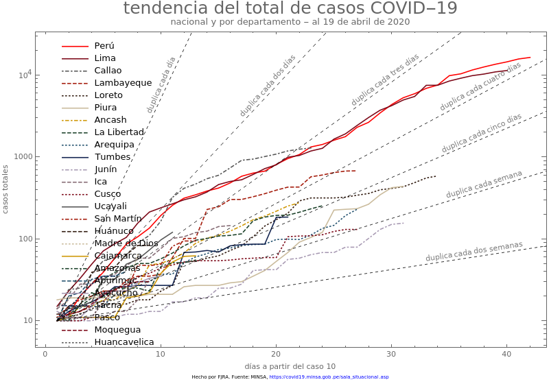
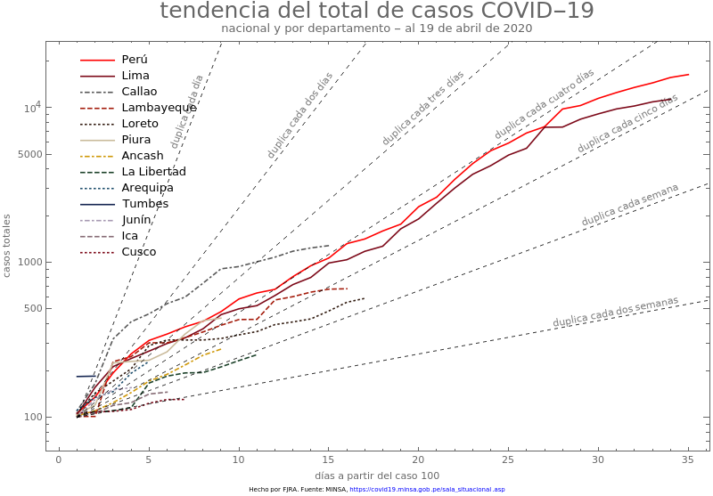

```{r setup, include=FALSE}
knitr::opts_chunk$set(echo = FALSE,warning = FALSE, message = FALSE)
```

```{r Librerias, echo=FALSE, message=FALSE}
library(tidyverse)
library(rio)
library(sf)
library(ggrepel)
library(ggpubr)
library(cowplot)
library(kableExtra)
data=rio::import("reportes_minsa.xlsx")

source("global.R", encoding = "UTF-8")
```


# Distribución casos positivos y fallecidos por región


```{r Mapa, message=FALSE}
departamento <- sf::read_sf("data/departamentos/DEPARTAMENTOS.shp") %>%
  dplyr::select(Departamento = DEPARTAMEN, geometry)

data2 = rio::import("reportes_minsa.xlsx", sheet=2)
data3 = data2 %>%
  dplyr::filter(Fecha == max(data2$Fecha)) %>%
  dplyr::rename(Departamento = REGION) %>%
  dplyr::group_by(Departamento) %>%
  dplyr::summarise(casos = sum(Positivos_totales))

m1 = departamento %>%
  dplyr::left_join(data3, by="Departamento") %>%
  dplyr::mutate(casos = tidyr::replace_na(casos,0),
         casos=as.factor(casos),
         label = paste0(Departamento, ": ", casos))%>%
  ggplot2::ggplot() +
    ggplot2::geom_sf(ggplot2::aes(fill = casos), size = 0.05, color = "grey40") +
  # colorRampPalette crea una paleta de colores del tamaño de factor(casos) -1
    ggplot2::scale_fill_manual(values = c(grDevices::colorRampPalette(colors = c("#FFF5F0","#FB6A4A", "#67000D"))(length(unique(data3$casos))))) +
  ggrepel::geom_label_repel(
    ggplot2::aes(label = label, geometry = geometry),
    stat = "sf_coordinates", 
    size = 2.3,
    min.segment.length = 0
  )+
    ggplot2::scale_x_discrete()+
  ggtitle("Casos positivos por región")+
  ggplot2::theme_bw()+
  ggplot2::theme(legend.position = "none",
        axis.title = ggplot2::element_blank())
 
```


```{r m2}
departamento <- sf::read_sf("data/departamentos/DEPARTAMENTOS.shp") %>%
  dplyr::select(Departamento = DEPARTAMEN, geometry)

data2 = rio::import("reportes_minsa.xlsx", sheet=2)
data3 = data2 %>%
  dplyr::filter(Fecha == max(data2$Fecha)) %>%
  dplyr::rename(Departamento = REGION) %>%
  dplyr::group_by(Departamento) %>%
  dplyr::summarise(casos = sum(Fallecidos))

m2 = departamento %>%
  dplyr::left_join(data3, by="Departamento") %>%
  dplyr::mutate(casos = tidyr::replace_na(casos,0),
         casos=as.factor(casos),
         label = paste0(Departamento, ": ", casos))%>%
  ggplot2::ggplot() +
    ggplot2::geom_sf(ggplot2::aes(fill = casos), size = 0.05, color = "grey40") +
  # colorRampPalette crea una paleta de colores del tamaño de factor(casos) -1
    ggplot2::scale_fill_manual(values = c("grey80", grDevices::colorRampPalette(colors = c("#FFF5F0","#FB6A4A", "#67000D"))(length(unique(data3$casos)-1)))) +
  ggrepel::geom_label_repel(
    ggplot2::aes(label = label, geometry = geometry),
    stat = "sf_coordinates", 
    size = 2.3,
    min.segment.length = 0
  )+
    ggplot2::scale_x_discrete()+
  ggtitle("Número de fallecidos por región")+
  ggplot2::theme_bw()+
  ggplot2::theme(legend.position = "none",
        axis.title = ggplot2::element_blank())
```


## Mapas 

```{r panelmapas, echo =FALSE,fig.height=8, message=FALSE, warning=FALSE}
plot_grid(m1,m2)
```

### Gif casos positivos 
<p align = center>
</p>

### Gif Fallecidos 
<p align = center>
</p>

# Tendencias por departamento

## Comparadas con Nacional y Lima

```{r echo=FALSE, out.width='80%'}

```

```{r echo=FALSE, out.width='80%'}

```

```{r echo=FALSE, out.width='80%'}
knitr::include_graphics('./Imagenes/tendenciaFallecimiento3-nacional-departamento-abril-19.png')
```

## Por Macro-Región

```{r plot_macro}
data4 = rio::import("reportes_minsa.xlsx", sheet=2)%>%
  dplyr::mutate(
    MACROREG= dplyr::case_when(
        REGION %in% c("TUMBES","PIURA","LAMBAYEQUE","LA LIBERTAD","CAJAMARCA","ANCASH") ~"NORTE",
        REGION %in% c("AMAZONAS","LORETO","UCAYALI","MADRE DE DIOS","SAN MARTIN") ~ "ORIENTE",
        REGION %in% c("ICA","MOQUEGUA","AREQUIPA","TACNA","PUNO","CUSCO") ~ "SUR",
        REGION %in% c("AYACUCHO","APURIMAC","JUNIN", "HUANCAVELICA", "HUANUCO", "PASCO") ~ "CENTRO",
        TRUE ~ "OTRO"),
    Fecha = as.Date(Fecha),
    Positivos=Positivos_totales
  )
```

### CENTRO 

[CENTRO](https://perucovid19.netlify.app/mr_centro)

### NORTE

[NORTE](https://perucovid19.netlify.app/mr_norte)

### SUR

[SUR](https://perucovid19.netlify.app/mr_sur)

### ORIENTE

[ORIENTE](https://perucovid19.netlify.app/mr_oriente)

## Información de las DIRESA: 

La información fue recopilada por los siguientes voluntari@s:

  - Nathan Nadramija (twitter: [NNadramija](https://twitter.com/nnnadramija))
  - Viviana Maldonado Garcia (twitter: [avimaga](https://twitter.com/avimaga))
  - Roy (twitter: [chicaidealista](https://twitter.com/chicaidealista))
  - Lucero Flores Werlen (twitter: [LuceroFloresW)](https://twitter.com/LuceroFloresW))

**Nota:** La información no está completa se debe tomar solo como referencia. Seguiremos intentando completar los datos y series de tiempo.  

Toda la información está disponible en la carpeta "data" del repositorio.

### Información sobre Fallecidos

```{r}
d3=import("./data/Data_departamental .xlsx", sheet="Detalles_Fallecidos") 

d3%>%group_by(Region,Sexo)%>%
  dplyr::summarise(Frecuencia=n(), Edad_promedio=round(mean(Edad,na.rm=TRUE),2))%>%
  kable("markdown")

```

**Condiciones Previas**

```{r}
d3%>%
  mutate(v2=strsplit(as.character(`Condición Preexistente`),","))%>%
  unnest(v2)%>%
  dplyr::select(v2)%>%
  group_by(v2)%>%
  summarise(frecuencia=n())%>%kable("markdown")
```


### Información sobre casos Positivos 

```{r}
d4=import("./data/Data_departamental .xlsx", sheet="Detalles_Positivos") 

d4%>%group_by(Region,Sexo)%>%
  dplyr::summarise(Frecuencia=n(), 
                   Edad_promedio=round(mean(Edad,na.rm=TRUE),2))%>%
  kable("markdown")
  
```


## Tabla 

```{r}
data2%>%
  dplyr::select(REGION,
                Positivos_PCR,Positivos_PR,Positivos_totales,Fallecidos,
                "Dia"="Fecha")%>%
  dplyr::mutate(Dia = as.character(Dia)) %>% 
  dplyr::arrange(dplyr::desc(Dia),dplyr::desc(Positivos_PCR)) %>%
  DT::datatable(
    options = list(pageLength = 10, 
                   lengthMenu = c(10, 25, 40),
                   language = list(lengthMenu = "Mostrar _MENU_ entradas",
                                   info ="Mostrando _START_ al _END_ de _TOTAL_ entradas",
                                   search = "Buscar:",
                                   paginate = list(previous = "Anterior",
                                                   'next' = "Siguiente"))
                   ),
    rownames = FALSE
  )
```


