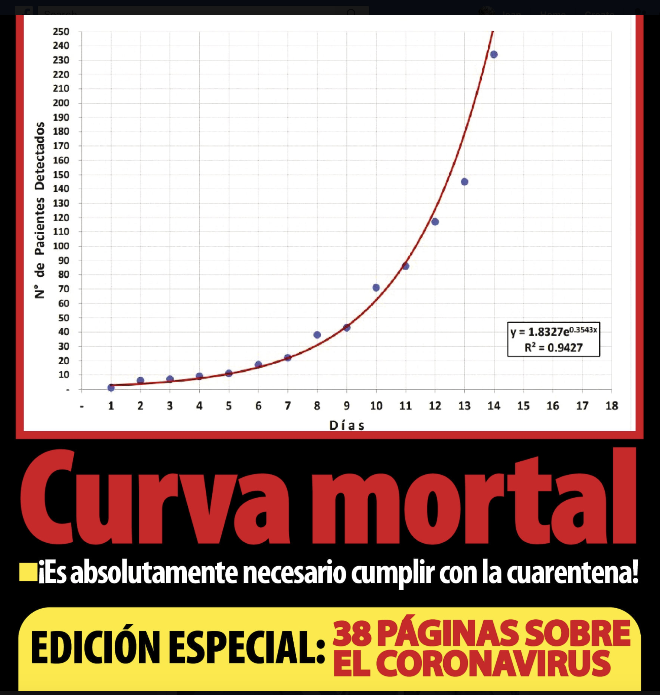

```{r setup, include=FALSE}
knitr::opts_chunk$set(echo = TRUE)
```

## Noticias Falsas

En esta página listasmo las noticias falsas que están circulando. Si se puede identificar quien las propaga o genera aun mejor. 

### Huida de ciudadanos

<blockquote class="twitter-tweet"><p lang="es" dir="ltr">⚠ ATENCIÓN | Respecto a publicaciones en redes sociales que señalan la huida de ciudadanos con casos confirmados de <a href="https://twitter.com/hashtag/COVID19?src=hash&amp;ref_src=twsrc%5Etfw">#COVID19</a> del <a href="https://twitter.com/HospitalOficial?ref_src=twsrc%5Etfw">@HospitalOficial</a>, el <a href="https://twitter.com/hashtag/Minsa?src=hash&amp;ref_src=twsrc%5Etfw">#Minsa</a> informa que son FALSAS. <a href="https://twitter.com/hashtag/Per%C3%BAEst%C3%A1EnNuestrasManos?src=hash&amp;ref_src=twsrc%5Etfw">#PerúEstáEnNuestrasManos</a><br><br>Para más información ➡ <a href="https://t.co/F4GaDrN5dc">https://t.co/F4GaDrN5dc</a> <a href="https://t.co/uzBOiCr23K">pic.twitter.com/uzBOiCr23K</a></p>&mdash; Ministerio de Salud (@Minsa_Peru) <a href="https://twitter.com/Minsa_Peru/status/1240466773704507392?ref_src=twsrc%5Etfw">March 19, 2020</a></blockquote> <script async src="https://platform.twitter.com/widgets.js" charset="utf-8"></script>

### Mensaje sobre Bono

<blockquote class="twitter-tweet"><p lang="es" dir="ltr">📢<a href="https://twitter.com/hashtag/MEFInforma?src=hash&amp;ref_src=twsrc%5Etfw">#MEFInforma</a> que este mensaje de texto es falso. <br>Pedimos a la población no dejarse sorprender con noticias falsas. <br>La información sobre la asignación del bono anunciado se dará a conocer a través de los canales oficiales.<a href="https://twitter.com/hashtag/Per%C3%BAEst%C3%A1EnNuestrasManos?src=hash&amp;ref_src=twsrc%5Etfw">#PerúEstáEnNuestrasManos</a> <a href="https://t.co/Ubq6UMq7hF">pic.twitter.com/Ubq6UMq7hF</a></p>&mdash; Ministerio de Economía y Finanzas (@MEF_Peru) <a href="https://twitter.com/MEF_Peru/status/1240372186801754112?ref_src=twsrc%5Etfw">March 18, 2020</a></blockquote> <script async src="https://platform.twitter.com/widgets.js" charset="utf-8"></script>

### Whatssapp sobre Estado de Emergencia

<blockquote class="twitter-tweet"><p lang="es" dir="ltr">Este mensaje que circula por WhatsApp es falso. <br>Pedimos a la población no dejarse sorprender por información anónima que circula por medios digitales. ¡Acude siempre a fuentes oficiales!<a href="https://twitter.com/hashtag/Per%C3%BAEst%C3%A1EnNuestrasManos?src=hash&amp;ref_src=twsrc%5Etfw">#PerúEstáEnNuestrasManos</a> <a href="https://t.co/iGX5cwfzCX">pic.twitter.com/iGX5cwfzCX</a></p>&mdash; MINDEF PERU (@MindefPeru) <a href="https://twitter.com/MindefPeru/status/1240103199433994240?ref_src=twsrc%5Etfw">March 18, 2020</a></blockquote> <script async src="https://platform.twitter.com/widgets.js" charset="utf-8"></script>

### Cartilla sobre Estado de Emergencia

<blockquote class="twitter-tweet"><p lang="es" dir="ltr"><a href="https://twitter.com/hashtag/PNPInforma?src=hash&amp;ref_src=twsrc%5Etfw">#PNPInforma</a>📢| Con relación a una cartilla que viene circulando por redes sociales, sobre instrucciones para el Estado de Emergencia Nacional, informamos a la opinión pública que dicha información es falsa. <a href="https://twitter.com/hashtag/FakeNews?src=hash&amp;ref_src=twsrc%5Etfw">#FakeNews</a> <a href="https://twitter.com/hashtag/NoCaigas?src=hash&amp;ref_src=twsrc%5Etfw">#NoCaigas</a> <a href="https://t.co/W9QCarA3DG">pic.twitter.com/W9QCarA3DG</a></p>&mdash; Policía Nacional del Perú (@PoliciaPeru) <a href="https://twitter.com/PoliciaPeru/status/1239752286001397762?ref_src=twsrc%5Etfw">March 17, 2020</a></blockquote> <script async src="https://platform.twitter.com/widgets.js" charset="utf-8"></script>

### Mascarillas

Aclaración: Las mascarillas hechas en casa no previenen el coronovirus. 
<blockquote class="twitter-tweet"><p lang="es" dir="ltr"><a href="https://twitter.com/hashtag/MGPVideo?src=hash&amp;ref_src=twsrc%5Etfw">#MGPVideo</a> ¿Sabes cómo hacer una mascarilla? Nosotros te enseñamos 👇 <a href="https://twitter.com/hashtag/YoMeQuedoEnCasa?src=hash&amp;ref_src=twsrc%5Etfw">#YoMeQuedoEnCasa</a><a href="https://twitter.com/hashtag/Per%C3%BAEstaEnNuestrasManos?src=hash&amp;ref_src=twsrc%5Etfw">#PerúEstaEnNuestrasManos</a><a href="https://twitter.com/hashtag/ManteniendolaCalmaloVenceremos?src=hash&amp;ref_src=twsrc%5Etfw">#ManteniendolaCalmaloVenceremos</a> <a href="https://t.co/BEaHr3CBVj">pic.twitter.com/BEaHr3CBVj</a></p>&mdash; Marina de Guerra (@naval_peru) <a href="https://twitter.com/naval_peru/status/1239580746072891393?ref_src=twsrc%5Etfw">March 16, 2020</a></blockquote> <script async src="https://platform.twitter.com/widgets.js" charset="utf-8"></script>

### Gárgaras 

FALSO: 

```{r echo=FALSE, out.width='80%'}

```

## Artículos imprecisos


###ESTIMACIÓN DE LA PROPAGACIÓN DEL CORONAVIRUS 2019

Está circulando por redes sociales un PDF titulado:

"ESTIMACIÓN DE LA PROPAGACIÓN DEL CORONAVIRUS 2019 (COVID-19) EN PERU UN MODELO SIR"
De: Jairo Pinedo Taquía & Jhelly Peréz Núñez


Los responsables de este sitio creemos que es el documento en el estado actual es impreciso, y que su difusión puede generar mayor desinformación en la población.

1) El PDF de tres páginas no es un artículo científico. No se le puede dar tal credibilidad. El artículo no ha pasado por revisión de pares, ni está avalado por algún revista especializada nacional o extranjera y se debió aclarar que el documento es un borrador/proyecto etc, más no un artículo.

2) El texto tiene varias imprecisiones o supuestos que no son discutidos con la profundidad que corresponde. Entre ellos que:
-  No se puede asumir a Perú como un bloque interconectado. 
-  No tienen un ajuste de datos apropiado y un control de sensibilidad de variables. El inicio de la curva epidémica ajustado a pocos datos puede generar imprecisión si tratamos de inferir a partir de ella. Estos  nos podrían llevar a escenarios tan disímiles  como Corea del Sur o Italia.
- No se puede ignorar el periodo asintomático en esta epidemia. Hay reportes clínicos y epidemiológicos de ser un factor importante de contagio. En ese sentido, el modelo más simple a usar no sería SIR, sino SEIR. Este cambio es importante pues ralentiza el paso de la población susceptible a la población infectada.

### Tendencia de crecimiento exponencial del numero de casos de COVID-19, no número de muertos

**Comentario: Joan Martinez** 

Articulos como los publicados por el periódico [New York Times](https://www.vox.com/future-perfect/2020/3/20/21179040/coronavirus-us-italy-not-overreacting) or [Washintong Post](https://www.washingtonpost.com/graphics/2020/world/corona-simulator/) han empleado visualzaciones de la evolución del número total de casos en países con alta incidencia del COVID-19 como Italia o China. Estos gráficos permiten ver una tendencia exponencial en el número de casos de pacientes de COVID-19, lo cual se usa principalmente para enfatizar la importancia de implementar medidas de mitigación **inmediatas** para reducir la propagación del virus a nivel mundial. En Peru, tambien hubo esfuerzos recientes de periodistas locales buscando replicar este ejercicio. No obstante, sus artículos caen en algunas imprecisiones que serán mencionadas a continuación.

- Con fecha 19 de Marzo, el 2020 artículo de Jaime Althaus publicado en  [Lampadia](https://www.lampadia.com/analisis/economia/podrian-morir-125-mil-peruanos) estima que $125,000$ peruanos podrian fallecer a causa del Coronavirus. 
- Asimismo el artículo publicado en [Hildebrant en sus Trece](http://www.hildebrandtensustrece.com) y la portada su Edición 484 indica que es una curva "mortal". 

```{r echo=FALSE, out.width="80%"}
knitr::include_graphics('./Imagenes/Althaus.png')
```

```{r echo=FALSE, out.width="80%"}

```

**Ambos artículos asumen que los pacientes que hayan contraido el virus se convertirán en víctimas mortales lo cual no es enteramente cierto.** De acuerdo al sistema de información de [John Hopkins University](https://gisanddata.maps.arcgis.com/apps/opsdashboard/index.html#/bda7594740fd40299423467b48e9ecf6) solo el 4.13% de pacientes que han contraido el virus a nivel mundial han sido víctimas fatales. 

Asimismo, los artículos de los periodistas locales referidos incluyen *proyecciones* puntuales del número de casos de pacientes contagiados. Sus proyecciones son elaboradas directamente por el equipo periodístico a cargo de la nota en el caso de Hildebrant y citando a un colaborador (doctor) del Sistema Integral de Salud, en el caso de Althaus. Comunicar una proyección del número de casos puede ser alarmante (e incluso irresponsable) para la población no especializada. Siendo concientes de esto, las notas periodisticas de NYT y WP *describen* el número de casos que ya han sido reportados a las autoridades de salud de sus respectivos países y los comparan con las tendencias de crecimiento *observadas* para otras naciones con un ratio de contagio y número de días de exposición más alto. **Es decir, a diferencia de los periodistas locales, otros medios de comunicacióon no incurren en reportar proyecciones dado que esto requiere de estimaciones epidemiológicas o bioestadísticas por parte de especialistas en la materia.**

Una visualización de la tendencia que sigue el número de casos de COVID-19 a la fecha se reporta a continuación. Esta tendencia puede ser revertida con el acatamiento del distanciamiento social impuesto por el gobierno.

```{r Liblibraris, echo=FALSE, message=FALSE}
library(rio)
library(dplyr)
library(tidyr)
library(ggplot2)
library(gridExtra)
library(kableExtra)
library(tidyverse)
library(cowplot)
library(readxl)
library(JLutils)
library(ggpubr)
#library(cowubr)

#J Incio
data=import("reportes_minsa.xlsx")
```

```{r exponencial, echo=FALSE, message=FALSE}
library(plotly)
require(ggplot2)

#Data inicial
dat2 <- data %>%
  dplyr::group_by(Dia)%>%
  dplyr::summarise(Total_Pruebas=max(Total_Pruebas),
                   Positivos=max(Positivos))%>%
  mutate(pos_new=Positivos-lag(Positivos,default = 0),
         pruebas_dia=Total_Pruebas-lag(Total_Pruebas,default = 0))

dia_list <- tibble(time= 1:length(dat2$Dia), .name_repair = "minimal")
dat2 <-add_column(dat2, dia_list= dia_list)

dat2$Dia<- as.Date(as.POSIXct(dat2$Dia, 'GMT'))

# Fitting exp fn a data
## Fitting linear model to get initial parameters y = \alpha * exp(beta * x)
x <- unlist(dat2$dia_list$time)
y <- unlist(dat2$Positivos)
data.df <- data.frame(x = x, y = y)
exp.model0 <-lm(log(y) ~ x, data.df)
alpha.0 <- exp(coef(exp.model0)[1])
beta.0 <- coef(exp.model0)[2]

## Starting parameters
start <- list(alpha = alpha.0, beta = beta.0)
## Fitting nlm
exp.model <- nls(y ~ alpha*exp(beta*x), data = data.df, start = start)
#coef(exp.model)[1]
#coef(exp.model)[2]

#Serie de numero de casos confirmados
library(scales)
f1<-dat2 %>%
  ggplot(aes(x = Dia)) +
  scale_x_date(labels = date_format("%b-%d"), breaks = date_breaks("2 days"), expand = c(0,1))+
  ylim(0,max(dat2$Positivos)*1.15)+
  geom_area(aes(y = Positivos, col = "Acumulados"), size=1, fill="#c9c4e0") +
  geom_point(aes(y = Positivos), col = "#474785") +
  geom_text(aes(Dia, Positivos, label = Positivos), vjust = -2, size=3)+
  geom_bar(aes(y = pos_new, fill = "Nuevos"), stat = "identity", alpha=.5)+
  geom_text(aes(Dia, pos_new, label = pos_new), vjust = 2, size=2)+
  stat_smooth(aes(y=Positivos), method="glm", method.args = list(family = gaussian(link="log")),  se=FALSE, linetype=1, size=0.4, colour="blue") +
  labs(color= NULL, fill = NULL, caption = paste0("Actualizado al ", format(as.Date(max(dat2$Dia)),"%d-%m"))) +
  scale_fill_manual(values = c("Nuevos" = "#1c8b7d")) +
  scale_color_manual(values = c("Acumulados" = "#c9c4e0", "Tendencia exponencial" = "blue")) +
  theme(legend.position="bottom")+
  annotate("segment", x=as.Date("2020-03-05"), xend=as.Date("2020-03-07"), y = 76, yend = 76, colour = "blue")+
#  annotate("text", x=as.Date("2020-03-06"), y = 270, label = "Exponencial", size= 3)+
  annotate("text", x=as.Date("2020-03-07"), y = 65, label = "y= 3.58096*exp(0.28987 * x)", size= 3, colour="blue")
```

```{r Panel, message=FALSE, echo=FALSE}
# Panel para publicacion
panel<- ggarrange(f1,
          ncol=1,nrow=1,
          font.label = list(size = 10, color = "black", face = "bold", family = NULL))
          annotate_figure(panel,
                top = text_grob("Número de casos positivos de pacientes COVID-19, Perú", color = "#474785", face = "bold", size = 14),
                bottom = text_grob("Fuente: MINSA. Ver (https://jincio.github.io/COVID_19_PERU/Propagacion.html)", color = "black", hjust = 1, x = 1, face = "italic", size = 8)
                #left = text_grob("Figure arranged using ggpubr", color = "green", rot = 90),
                #fig.lab = "Figure 1", fig.lab.face = "bold"
)

```

