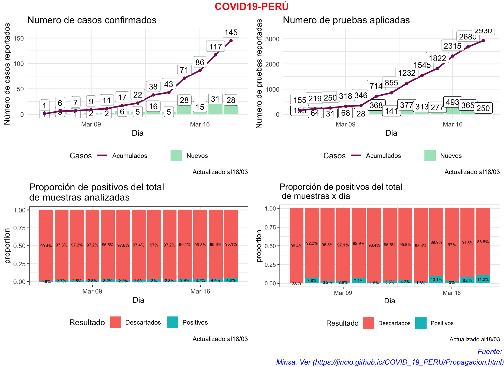

```{r setup, include=FALSE}
knitr::opts_chunk$set(echo = FALSE)
```

## Casos Reportados

```{r, echo=FALSE, message=FALSE}
library(rio)
library(dplyr)
library(tidyr)
library(ggplot2)
library(gridExtra)
library(kableExtra)
library(JLutils)
library(tidyverse)
library(sf)
library(readxl)
library(cowplot)
library(ggpubr)
data=import("reportes_minsa.xlsx")
```

```{r}
dat2 <- data %>%
  dplyr::group_by(Dia)%>%
  dplyr::summarise(Total_Pruebas=max(Total_Pruebas),
                   Positivos=max(Positivos))%>%
  mutate(pos_new=Positivos-lag(Positivos,default = 0),
         pruebas_dia=Total_Pruebas-lag(Total_Pruebas,default = 0))

f3=dat2 %>%
  mutate(neg_new=pruebas_dia-pos_new)%>%
  dplyr::select(Dia, Descartados=neg_new, 
                Positivos=pos_new)%>%
  gather(res, count, -Dia)%>%
  uncount(count) %>%
  ggplot(aes(x = Dia, fill = res)) +
  geom_bar(position = "fill") +
  stat_fill_labels(size=2)+
  #scale_fill_discrete_sequential(palette="BluGrn") +
  labs(y = "proportion", fill = "Resultado",
       title = paste0("Proporción de positivos del total \n de muestras x dia"),
       caption = paste0("Actualizado al", format(as.Date(max(data$Dia)),"%d/%m"))) +
  theme_bw() +
  theme(text = element_text(size=10),
        legend.position="bottom")

f1=dat2 %>%
  ggplot(aes(x = Dia)) +
  ylim(0,max(dat2$Positivos)*1.1)+
  geom_bar(aes(y = pos_new, fill = "Nuevos"), stat = "identity", alpha=.5)+
  geom_label(aes(Dia, pos_new, label = pos_new), vjust = 0.5,label.size = 0.10)+
  geom_line(aes(y = Positivos, col = "Acumulados"), size=1) +
  geom_point(aes(y = Positivos), col = "#8B1C62") +
  geom_label(aes(Dia, Positivos, label = Positivos), vjust = -0.3,
             label.size = 0.07)+
  labs(y = "Número de casos reportados", color = " Casos", fill = " ", 
       title = paste0("Numero de casos confirmados"),
       caption = paste0("Actualizado al", format(as.Date(max(data$Dia)),"%d/%m"))) +
  scale_fill_manual(values = c("Nuevos" = "#43CD80")) +
  scale_color_manual(values = c("Acumulados" = "#8B1C62")) +
  #scale_y_continuous() +
  theme_minimal() +
  theme(legend.position="bottom")


f2=data %>%
  dplyr::select(Dia, Positivos, Descartados)%>%
  gather(res, count, -Dia)%>%
  uncount(count) %>%
  ggplot(aes(x = Dia, fill = res)) +
  geom_bar(position = "fill") +
  stat_fill_labels(size=2)+
  #scale_fill_discrete_sequential(palette="BluGrn") +
  labs(y = "proportion", fill = "Resultado",
       title = paste0("Proporción de positivos del total \nde muestras analizadas"),
       caption = paste0("Actualizado al", format(as.Date(max(data$Dia)),"%d/%m"))) +
  theme_bw() +
  theme(legend.position="bottom")

f4=dat2 %>%
  ggplot(aes(x = Dia)) +
  ylim(0,max(dat2$Total_Pruebas)*1.1)+
  geom_bar(aes(y = pruebas_dia, fill = "Nuevos"), stat = "identity", alpha=.5)+
  geom_label(aes(Dia, pruebas_dia, label = pruebas_dia), vjust = 0.5)+
  geom_line(aes(y = Total_Pruebas, col = "Acumulados"), size=1) +
  geom_point(aes(y = Total_Pruebas), col = "#8B1C62") +
  geom_label(aes(Dia, Total_Pruebas, label = Total_Pruebas), vjust = -0.5,
             label.size = 0.07)+
  labs(y = "Numero de pruebas reportadas", color = " Casos", fill = " ",
       title = paste0("Numero de pruebas aplicadas"),
       caption = paste0("Actualizado al", format(as.Date(max(data$Dia)),"%d/%m"))) +
  scale_fill_manual(values = c("Nuevos" = "#43CD80")) +
  scale_color_manual(values = c("Acumulados" = "#8B1C62")) +
  #scale_y_continuous(sec.axis = sec_axis(~ .)) +
  theme_minimal() +
  theme(legend.position="bottom")
```

## Panel conjunto 

Para los gráficos indivisudales he adaptado del post de Gabriel Carrasco Escobar (http://gcarrasco.rbind.io/blog/covid19_viz/)

```{r, message=FALSE, eval=FALSE}
panel=ggarrange(f1,f4,f2,f3,
          ncol=2,nrow=2,
          widths = c(0.5,0.5,0.5,0.5),
          font.label = list(size = 10, color = "black", face =
                              "bold", family = NULL))


annotate_figure(panel,
                top = text_grob("COVID19-PERÚ", color = "red", face = "bold", size = 14),
                bottom = text_grob("Fuente: \n Minsa. Ver (https://jincio.github.io/COVID_19_PERU/Propagacion.html)", color = "blue",
                                   hjust = 1, x = 1, face = "italic", size = 10),
                #left = text_grob("Figure arranged using ggpubr", color = "green", rot = 90),
                #right = "www.joseincio.com",
                #fig.lab = "Figure 1", fig.lab.face = "bold"
)

```


When a figure is not generated from R code, you may use knitr::include_graphics() to insert it to the document, e.g.

```{r echo=FALSE, out.width='100%'}

```

## Mapa

```{r}
departamento<- read_sf("~/Box Sync/BD/Shapes/LIMITES INEI_2016/DEPARTAMENTO_30_JULIO_2016.shp")%>%
  select(Departamento = NOMBDEP, 
         geometry)

data2=import("reportes_minsa.xlsx", sheet=2)
data3=data2%>%
  filter(Fecha==max(data2$Fecha))%>%
  mutate(Departamento=ifelse(Departamento=="CALLAO","LIMA",
                             Departamento))%>%
  dplyr::group_by(Departamento)%>%
  dplyr::summarise(casos=sum(Positivos))


colores<- c("grey80",
                      "dodgerblue4",
                      "forestgreen",
                      "deepskyblue3",
                      "mediumpurple4",
                      "royalblue3",
            "darkred"
                      # "brown3",
                      # "gold2",
                      # "grey80"
                      )
m1=departamento%>%
  left_join(data3, 
                         by="Departamento")%>%
  mutate(casos=replace_na(casos,0))%>%
  mutate(casos=as.factor(casos))%>%
  ggplot()+
  geom_sf(aes(fill = casos))+
  scale_x_discrete()+
  scale_fill_manual(values = colores)+
  labs(title = paste0("Número de casos positivos al: ", format(as.Date(max(data2$Fecha)),"%d/%m")),
       caption = "Callao se suma a Lima",
       fill="Casos")+
  theme(plot.title = element_text(hjust = 0.5),
        panel.background = element_blank())
```

```{r}
plot_grid(m1)
```

## Gráficos Individuales 

### Número de pacientes positivos

```{r}
plot_grid(f1)
```

### Proporción del total 

```{r}
plot_grid(f2)
```

### Proporción de positivos por pruebas aplicadas en el día
```{r}
plot_grid(f3)
```

### Pruebas

```{r, message=FALSE}
plot_grid(f4)
```

## Tabla

```{r}
data%>%dplyr::group_by(Dia)%>%
  dplyr::summarise(Positivos=max(Positivos),
            Pruebas_aplicadas=max(Total_Pruebas))%>%
            mutate(  
            lag=lag(Pruebas_aplicadas, default = 0),
            lag2=lag(Positivos,default = 0),
            Pruebas_XDia=Pruebas_aplicadas-lag,
            Nuevos_Positivos=Positivos-lag2)%>%
  dplyr::select(-c(lag,lag2))%>%kable()
            
```


## Fuentes

Para la construcción de la tabla he usado la información difundida por MINSA en su cuenta oficial de twitter [@Minsa_Peru](https://twitter.com/Minsa_Peru)


03/18

<blockquote class="twitter-tweet"><p lang="es" dir="ltr">🗓 Reporte │ Esta es la situación del coronavirus <a href="https://twitter.com/hashtag/COVID19?src=hash&amp;ref_src=twsrc%5Etfw">#COVID19</a> en Perú hasta las 7:00 horas del 18 de marzo. <a href="https://twitter.com/hashtag/Per%C3%BAEst%C3%A1EnNuestrasManos?src=hash&amp;ref_src=twsrc%5Etfw">#PerúEstáEnNuestrasManos</a><br><br>Para más información, visita: <a href="https://t.co/F4GaDrvulE">https://t.co/F4GaDrvulE</a> <a href="https://t.co/pPPwxu13dG">pic.twitter.com/pPPwxu13dG</a></p>&mdash; Ministerio de Salud (@Minsa_Peru) <a href="https://twitter.com/Minsa_Peru/status/1240305962256343040?ref_src=twsrc%5Etfw">March 18, 2020</a></blockquote> <script async src="https://platform.twitter.com/widgets.js" charset="utf-8"></script>

03/17 

<blockquote class="twitter-tweet"><p lang="es" dir="ltr">🗓 Reporte │ Esta es la situación del coronavirus <a href="https://twitter.com/hashtag/COVID19?src=hash&amp;ref_src=twsrc%5Etfw">#COVID19</a> en Perú hasta las 8:20 horas del 17 de marzo. <a href="https://twitter.com/hashtag/Per%C3%BAEst%C3%A1EnNuestrasManos?src=hash&amp;ref_src=twsrc%5Etfw">#PerúEstáEnNuestrasManos</a><br><br>Para más información, visita: <a href="https://t.co/F4GaDrvulE">https://t.co/F4GaDrvulE</a> <a href="https://t.co/8yojgp7eYw">pic.twitter.com/8yojgp7eYw</a></p>&mdash; Ministerio de Salud (@Minsa_Peru) <a href="https://twitter.com/Minsa_Peru/status/1239982787404455940?ref_src=twsrc%5Etfw">March 17, 2020</a></blockquote> <script async src="https://platform.twitter.com/widgets.js" charset="utf-8"></script>

03/16 

<blockquote class="twitter-tweet"><p lang="es" dir="ltr">🗓 Reporte │ Esta es la situación del coronavirus <a href="https://twitter.com/hashtag/COVID19?src=hash&amp;ref_src=twsrc%5Etfw">#COVID19</a> en Perú hasta las 8:46 horas del 16 de marzo. <a href="https://twitter.com/hashtag/Per%C3%BAEst%C3%A1EnNuestrasManos?src=hash&amp;ref_src=twsrc%5Etfw">#PerúEstáEnNuestrasManos</a><br><br>Para más información, visita: <a href="https://t.co/F4GaDrvulE">https://t.co/F4GaDrvulE</a> <a href="https://t.co/fsY4PTgtFL">pic.twitter.com/fsY4PTgtFL</a></p>&mdash; Ministerio de Salud (@Minsa_Peru) <a href="https://twitter.com/Minsa_Peru/status/1239569760704253952?ref_src=twsrc%5Etfw">March 16, 2020</a></blockquote> <script async src="https://platform.twitter.com/widgets.js" charset="utf-8"></script>


03/15

<blockquote class="twitter-tweet"><p lang="es" dir="ltr">🗓 Reporte │ Esta es la situación del coronavirus en Perú hasta las 13:10 horas del 15 de marzo. <br><br>Para más información, visita: <a href="https://t.co/F4GaDrvulE">https://t.co/F4GaDrvulE</a> <a href="https://t.co/HUR87UVlxQ">pic.twitter.com/HUR87UVlxQ</a></p>&mdash; Ministerio de Salud (@Minsa_Peru) <a href="https://twitter.com/Minsa_Peru/status/1239264360549224449?ref_src=twsrc%5Etfw">March 15, 2020</a></blockquote> <script async src="https://platform.twitter.com/widgets.js" charset="utf-8"></script>

03/14

<blockquote class="twitter-tweet"><p lang="es" dir="ltr">🗓 Reporte │ Esta es la situación del coronavirus en Perú hasta las 19:20 horas del 14 de marzo. <br><br>Para más información, visita: <a href="https://t.co/F4GaDrvulE">https://t.co/F4GaDrvulE</a> <a href="https://t.co/102MJF7uPE">pic.twitter.com/102MJF7uPE</a></p>&mdash; Ministerio de Salud (@Minsa_Peru) <a href="https://twitter.com/Minsa_Peru/status/1238994119646744578?ref_src=twsrc%5Etfw">March 15, 2020</a></blockquote> <script async src="https://platform.twitter.com/widgets.js" charset="utf-8"></script>

03/13

<blockquote class="twitter-tweet"><p lang="es" dir="ltr">🗓 Reporte │ Esta es la situación del coronavirus en Perú hasta las 16:00 horas del 13 de marzo. <br><br>Para más información, visita: <a href="https://t.co/ATXAITDSWN">https://t.co/ATXAITDSWN</a> <a href="https://t.co/ERDFeBV7Tq">pic.twitter.com/ERDFeBV7Tq</a></p>&mdash; Ministerio de Salud (@Minsa_Peru) <a href="https://twitter.com/Minsa_Peru/status/1238579158852263936?ref_src=twsrc%5Etfw">March 13, 2020</a></blockquote> <script async src="https://platform.twitter.com/widgets.js" charset="utf-8"></script>

03/12

<blockquote class="twitter-tweet"><p lang="es" dir="ltr">🗓 Reporte │ Esta es la situación del coronavirus en Perú hasta las 9:55 horas del 12 de marzo. <br><br>Para más información, visita: <a href="https://t.co/ATXAITDSWN">https://t.co/ATXAITDSWN</a> <a href="https://t.co/Yr2gGdPc1f">pic.twitter.com/Yr2gGdPc1f</a></p>&mdash; Ministerio de Salud (@Minsa_Peru) <a href="https://twitter.com/Minsa_Peru/status/1238126203485270022?ref_src=twsrc%5Etfw">March 12, 2020</a></blockquote> <script async src="https://platform.twitter.com/widgets.js" charset="utf-8"></script>

03/11

<blockquote class="twitter-tweet"><p lang="es" dir="ltr">🗓 Reporte │ Esta es la situación del coronavirus en Perú hasta las 20:00 horas del 11 de marzo. <br><br>Para más información, visita: <a href="https://t.co/ATXAITDSWN">https://t.co/ATXAITDSWN</a> <a href="https://t.co/RgArH78FMz">pic.twitter.com/RgArH78FMz</a></p>&mdash; Ministerio de Salud (@Minsa_Peru) <a href="https://twitter.com/Minsa_Peru/status/1237916429975945217?ref_src=twsrc%5Etfw">March 12, 2020</a></blockquote> <script async src="https://platform.twitter.com/widgets.js" charset="utf-8"></script>

03/10

<blockquote class="twitter-tweet"><p lang="es" dir="ltr">🗓 Reporte │ Esta es la situación del coronavirus en Perú hasta las 8:00 horas del 10 de marzo. <br><br>Para más información, visita: <a href="https://t.co/Mv594Y83Y2">https://t.co/Mv594Y83Y2</a> <a href="https://t.co/y5o2DZffuL">pic.twitter.com/y5o2DZffuL</a></p>&mdash; Ministerio de Salud (@Minsa_Peru) <a href="https://twitter.com/Minsa_Peru/status/1237366697591541766?ref_src=twsrc%5Etfw">March 10, 2020</a></blockquote> <script async src="https://platform.twitter.com/widgets.js" charset="utf-8"></script>

03/09

<blockquote class="twitter-tweet"><p lang="es" dir="ltr">🗓 Reporte │ Esta es la situación del coronavirus en Perú hasta las 8:30 horas del 9 de marzo. <br><br>Para más información, visita: <a href="https://t.co/ATXAITDSWN">https://t.co/ATXAITDSWN</a> <a href="https://t.co/VUWdMFaJkJ">pic.twitter.com/VUWdMFaJkJ</a></p>&mdash; Ministerio de Salud (@Minsa_Peru) <a href="https://twitter.com/Minsa_Peru/status/1237064965468667904?ref_src=twsrc%5Etfw">March 9, 2020</a></blockquote> <script async src="https://platform.twitter.com/widgets.js" charset="utf-8"></script>

03/08

https://www.americatv.com.pe/noticias/actualidad/minsa-confirma-nuevo-caso-coronavirus-peru-n407677?hootPostID=e28f310a3c6b843dce1663d1e934ffed

Este tweet fue RT por el Minsa, por eso asumo que es la información oficial. MINSA no publicó ningún reporte como en los dias anteriores o posteriores. 


```{r, eval=FALSE}
#Gráfico de líneas antiguo
p1=data%>%
  dplyr::group_by(Dia)%>%
  dplyr::summarise(Positivos=max(Positivos))%>%
  ggplot(aes(x=Dia,y=Positivos, label=Positivos))+
  ggtitle("Pacientes positivos (acumulados)")+
  geom_line()+geom_label()
p2=data%>%
  dplyr::group_by(Dia)%>%
  dplyr::summarise(Positivos=max(Positivos))%>%
  mutate(lag=lag(Positivos),
         Nuevos=Positivos-lag)%>%
  ggplot(aes(x=Dia,y=Nuevos, label=Nuevos))+
  ggtitle("Pacientes nuevos por dia")+
  geom_line()+geom_label()
grid.arrange(p1, p2, ncol = 1)
```
